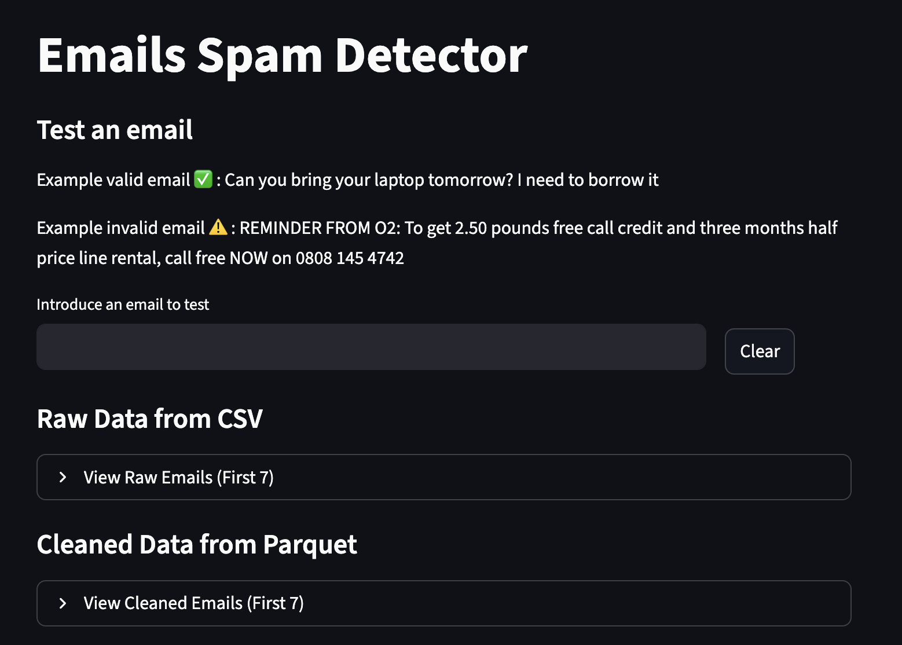

# emailanalyzer
This project includes an interactive web application built with Streamlit. The application allows users to interact with the trained model and visually explore the datasets.

### App Features:
- **Test Custom Emails:** Enter custom email text into the predictor to check if it's evaluated as "Spam" or "Ham" along with the model's confidence probability.
- **Explore Raw Data:** Visually inspect the original `spam_dataset.csv` data.
- **Explore Cleaned Data:** Visually inspect the `preprocessed_emails.parquet` file showing all engineered features and normalized text.
- **Model Evaluation Summary:** Displays a pie chart plot automatically generated by the visualization pipeline based on predictions on the testing data.



After this you need to installed uv and kedro

```
uv venv --python <version>
uv pip install kedro
```

## Steps to run the project

1. Sync the project:

```
uv sync
```

2. Register the pipelines:

```
uv run kedro registry list
```

3. Run pipelines:

```
uv run kedro run --pipeline data_processing
uv run kedro run --pipeline data_science
uv run kedro run --pipeline visualization
```

4. Run app:
```
uv run streamlit run app/app.py
```

## Create new pipelines
```
uv run kedro pipeline create data_processing_new
```

## Dependencies

Dependencies that use the project:

- jupyter ipykernel
- pandas
- matplotlib
- scikit-learn
- streamlit
- cloudpickle
- seaborn


Install new or add new
```
uv add 
```
